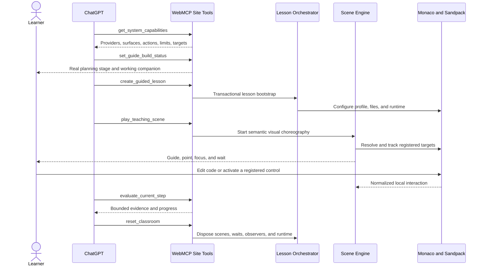
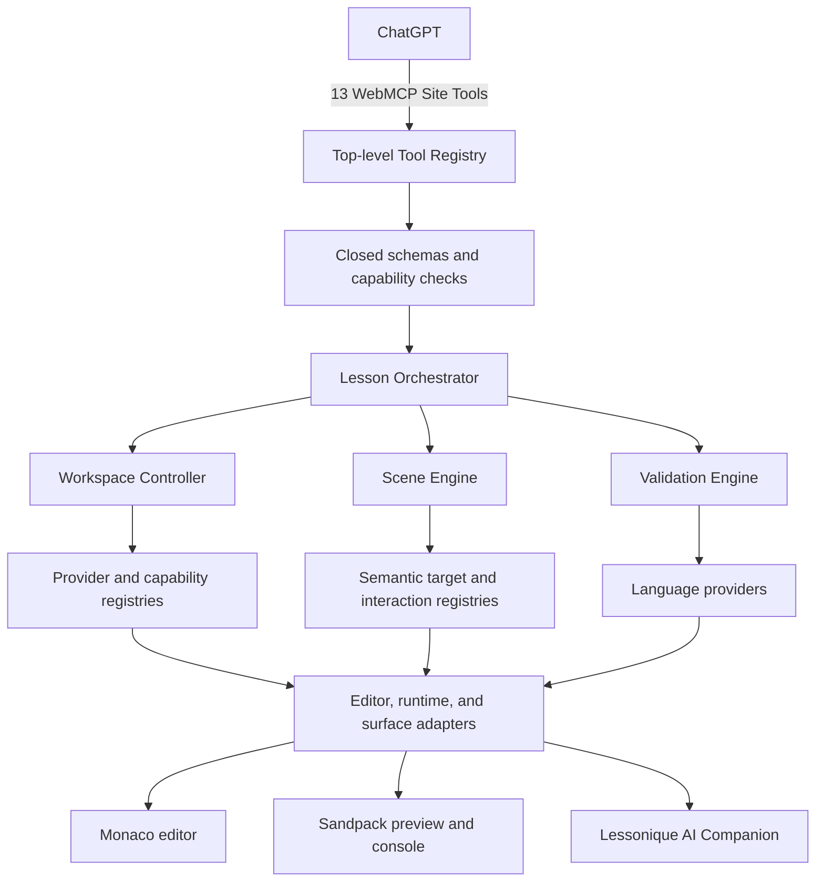
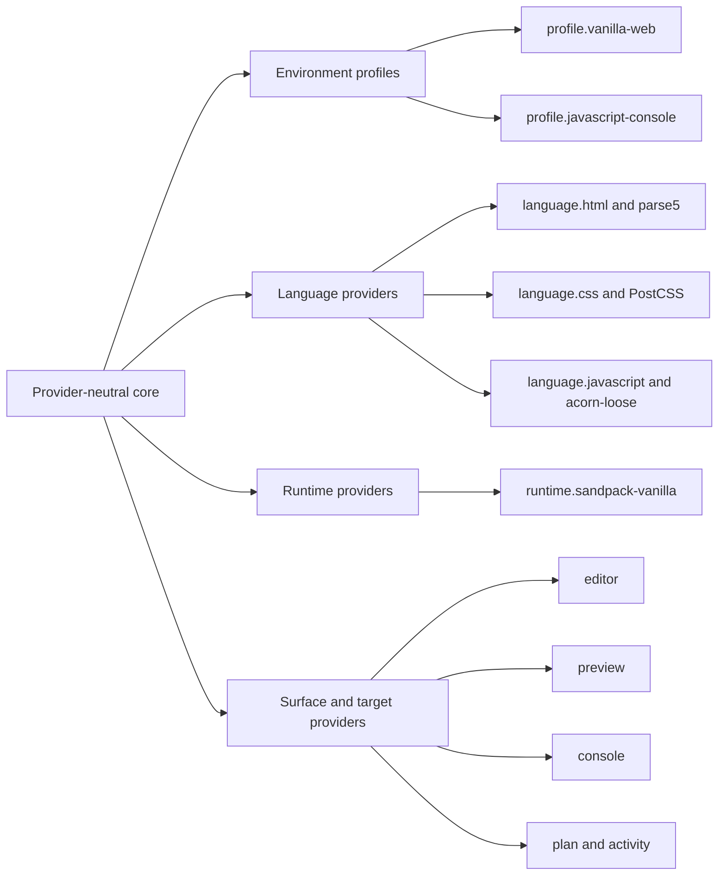

# Lessonique

Lessonique is an agent-guided coding classroom built for WebMCP. ChatGPT discovers a closed catalog of Site Tools, configures the learning environment, presents structured visual guidance, follows semantic targets across the editor and preview, waits for learner interactions locally, and evaluates declared criteria without solving the exercise for the learner.

[Open Lessonique](https://lessonique.com/)

## Why it matters

Most coding assistants can describe a change but cannot safely direct the learning surface around it. Lessonique gives ChatGPT high-level control of a real classroom while keeping the browser application responsible for rendering, target resolution, validation, interaction tracking, and lifecycle cleanup.

- ChatGPT remains the primary agent; Lessonique has no built-in chat or custom AI backend.
- The learner works in Monaco while Sandpack runs HTML, CSS, and vanilla JavaScript.
- Guidance uses provider-owned semantic targets, never public CSS selectors, XPath, DOM paths, or coordinates.
- Visual guides, captions, callouts, references, and companion reactions remain complete without audio.
- The root experience reports WebMCP compatibility and waits for a real agent invocation without mounting a fictional workspace.
- Once ChatGPT creates a guided lesson, the classroom exposes the same production handlers through its collapsed Dev Panel for review and testing.

## Challenge flow

The primary demonstration starts at `/`, moves from WebMCP discovery to a connected lobby, and builds and validates a responsive navigation menu without navigating away. ChatGPT discovers the available capabilities, creates the lesson, guides the learner through HTML, CSS, and JavaScript targets, waits for registered preview interactions locally, evaluates the result, and resets every owned resource. A second fixture replaces the environment with a JavaScript-only `Array.map()` lesson without reloading the page.



## Architecture

The core depends on extensible string identifiers and registries rather than a fixed list of languages or runtimes. WebMCP handlers validate intent and delegate to application use cases; they never manipulate React, Monaco, Sandpack, or the DOM directly.



The main boundaries are:

- **WebMCP Tool Layer** — registration, closed inputs, invocation lifecycle, compact results, and privacy-safe student-facing activity presentation.
- **Lesson Orchestrator** — lesson state, transactional bootstrap/reset, progress, attempts, and plan adaptation.
- **Workspace Controller** — the only layer that mutates files, profiles, surfaces, and runtime configuration.
- **Scene Engine** — cancelable choreography, semantic targets, companion placement, visual guides, effects, waits, and cleanup.
- **Provider Platform** — language, runtime, profile, surface, action, locator, target, interaction, and validator registries.
- **Adapters** — Monaco, Sandpack, Preview Bridge, console, and Lessonique-owned surface integration.

## Provider model



P0 deliberately implements only HTML, CSS, vanilla JavaScript, and Sandpack. The provider boundaries allow later Python, PHP, TypeScript, or framework specifications without rewriting the control plane; those providers are not part of this release.

## WebMCP Site Tools

All tools are registered from the top-level document through `document.modelContext.registerTool`. Inputs use closed schemas with `additionalProperties: false`, Zod validation, and capability checks.

| Tool | Responsibility |
|---|---|
| `get_system_capabilities` | Discover profiles, languages, runtimes, surfaces, actions, semantic targets, validators, and limits. |
| `set_guide_build_status` | Advance the real pre-classroom guide build through its three declared stages or report an actionable error. |
| `create_guided_lesson` | Transactionally create or replace the lesson, workspace, runtime, plan, and optional initial scene. |
| `reset_classroom` | Idempotently clear guidance, runtime, workspace, lesson state, or the complete classroom. |
| `inspect_classroom` | Read bounded lesson, workspace, runtime, scene, assistant, interaction, and evidence snapshots. |
| `configure_learning_environment` | Change profiles, files, surfaces, options, viewport, and focus without editing learner content. |
| `apply_workspace_changes` | Atomically create, replace, patch, move, or remove validated workspace files. |
| `execute_environment_action` | Run only actions declared by the active runtime, profile, or surface. |
| `play_teaching_scene` | Start a complete semantic visual choreography and return immediately. |
| `control_teaching_scene` | Pause, resume, navigate, restart, or cancel the active scene. |
| `evaluate_current_step` | Run provider-declared criteria and return bounded evidence. |
| `update_lesson_plan` | Adapt steps, hints, messages, and the active step without replacing the workspace. |
| `show_reference_panel` | Present structured text and code snippets in a registered non-modal surface. |

Assistant movement, focus, pointing, hints, reactions, and learner waits are typed scene operations rather than public microtools. There is no arbitrary DOM access, code evaluation, shell command, synthetic learner action, or unrestricted network tool.

## Security, accessibility, and lifecycle

- Learner code and preview content are untrusted.
- The typed, session-scoped Preview Bridge accepts allowlisted messages and privacy-filters interactions.
- Semantic targets are prepared and resolved by registered adapters; geometry is ephemeral and never public tool input.
- File paths, extensions, profiles, actions, surface options, target resolvers, and limits are capability-validated before mutation.
- Lesson replacement and reset cancel scenes, waits, observers, overlays, guides, timers, motion, validation, parsing, interaction subscriptions, and runtime resources.
- The companion and guide layers do not steal keyboard focus or pointer input.
- Reduced-motion mode preserves the final placement, state, content, and educational meaning.
- P0/V1 contains no in-app voice output, audio response, text-to-speech, speech synthesis, Web Speech API, or hidden browser fallback. The narrated submission video is an external artifact only.

## Run locally

Requirements:

- Node.js 24
- pnpm 12.1.0

```bash
pnpm install --frozen-lockfile
pnpm dev
```

Open `http://localhost:3000/`. In a WebMCP-capable ChatGPT session, the page advances from compatibility detection to connection confirmation and mounts the classroom only after `create_guided_lesson` succeeds. During local development, the production handlers can be exercised by starting a lesson and then expanding **WebMCP Dev Panel** to run either the complete tool fixtures or the staged challenge demo. The legacy `/classroom` URL redirects to `/`.

## Verification

### Judge quick start

1. Open [lessonique.com](https://lessonique.com/) in a WebMCP-capable ChatGPT in-app browser. No account or access code is required.
2. Confirm that ChatGPT discovers the 13 WebMCP Site Tools registered by the top-level document.
3. Invoke `get_system_capabilities`; the lobby should change from compatibility detection to a connected state.
4. Ask ChatGPT to create and guide the responsive-navigation lesson, or expand **WebMCP Dev Panel** after lesson creation to run the staged challenge demo.
5. Use `reset_classroom` to verify that the lesson, runtime, scenes, waits, overlays, and other owned resources are cleaned up.

The Vercel-generated `lessonique.vercel.app` alias remains available, but `lessonique.com` is the canonical production URL.

```bash
pnpm lint
pnpm typecheck
pnpm test
pnpm build
pnpm verify:release-performance
pnpm verify:release-boundaries
pnpm test:e2e
```

The browser suite covers tool discovery, transactional operations, both demo flows, target alignment and recovery, reduced motion, keyboard behavior, WCAG A/AA checks, runtime fallbacks, visual-only guidance, and resource cleanup.

To run the same desktop suite against the deployed application without starting a local server:

```bash
PLAYWRIGHT_BASE_URL=https://lessonique.com pnpm test:e2e:production
```

PowerShell:

```powershell
$env:PLAYWRIGHT_BASE_URL = "https://lessonique.com"
pnpm test:e2e:production
```

## Repository map

```text
e2e/                         Production browser flows and challenge rehearsals
scripts/                     Monaco asset sync and release boundary checks
src/adapters/                Monaco, Sandpack, preview, console, and surface adapters
src/components/              Classroom, workspace, WebMCP, and scene presentation
src/core/                    Provider-neutral platform, lesson, scene, workspace, and tools
src/features/challenge-demo/ Responsive-menu and Array.map fixtures
src/providers/p0/            HTML, CSS, JavaScript, Sandpack, and P0 registries
src/testing/                 Fake-provider extensibility coverage
```

Third-party attribution is available in [THIRD_PARTY_NOTICES.md](./THIRD_PARTY_NOTICES.md).

## License

Lessonique's original source code is available under the [MIT License](./LICENSE). Third-party software and assets remain governed by their respective terms as documented in [THIRD_PARTY_NOTICES.md](./THIRD_PARTY_NOTICES.md).
